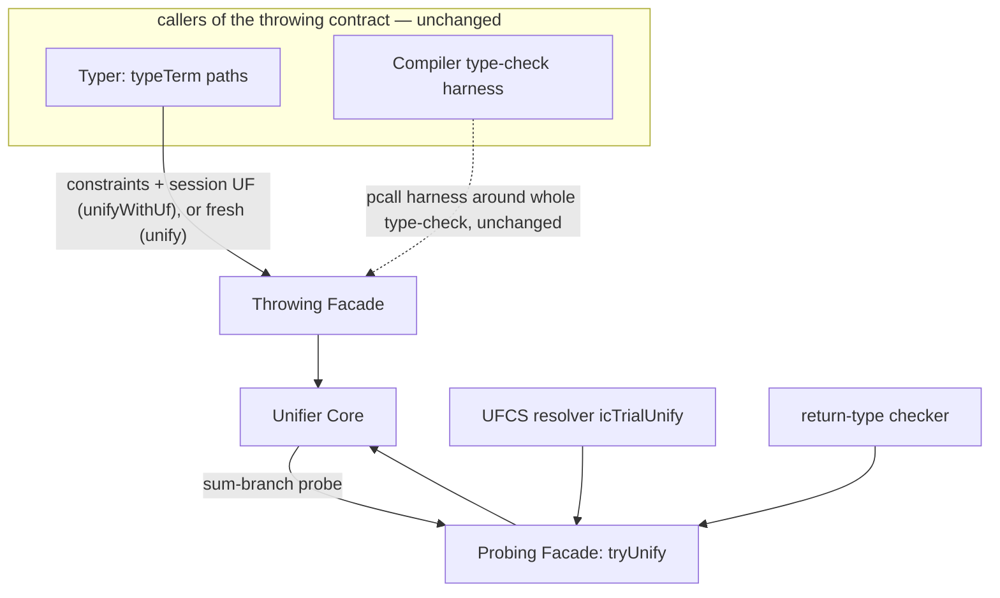

# tryUnify (issue #12) — Phase 1: Architecture

All diagrams and tables below describe the **target** state. Where today's
code differs, the difference is named explicitly.

## Goal & non-goals

- Trial unification answers "do these unify?" as a **value**; no
  `pcall`/`error` anywhere on the trial path.
- Exactly **one** unification algorithm; throwing lives only in thin
  facades. Error texts/codes/code points byte-identical with today.
- Behaviour preservation covers the warts too (see *Inherited behaviour*).
- Non-goals: changing sum backtracking order, occurs-check, path
  compression, binding-merge mechanics; fixing pre-existing hazards
  (listed below); touching the legitimate `pcall`s elsewhere.

## Logical modules

| Module | Responsibility (one line) |
|--------|---------------------------|
| **Unifier Core** | Solve a constraint queue against the UnionFind it is handed; mutate it; stop at the first failure and report it as a `Message` value; report success otherwise. |
| **Throwing Facade** | Legacy contract (`unify` = fresh UF, `unifyWithUf` = caller's UF): run the core, `error()` the returned `Message` verbatim. |
| **Probing Facade** | New contract (`tryUnify`): run the core on a fresh UF; failure ⇒ `unit`, success ⇒ the bindings array. |

The sum-branch probing inside the core is a **code path of the core**,
not a module (an earlier draft wrongly listed it as one). The three
trial-site consumers (UFCS resolver, return checker) stay where they are;
they only switch which facade they call.

## Diagram (target)

Today UR, RC and the core's sum branches reach trial behaviour via
`pcall(unify, …)`; the change reroutes those three call sites to the
Probing Facade and deletes the `pcall`s.

## Edge annotations

| From | To | Payload (type) | Sync/Async | Failure owner | Retry policy |
|------|----|----------------|------------|---------------|--------------|
| Throwing Facade | Core | `(constraints: array[Constraint], uf)` → `Message \| unit` (`unit` = success) | sync | Facade: `Message` ⇒ `error(msg)`, verbatim | none |
| Probing Facade | Core | `(constraints, fresh uf)` → `Message \| unit` | sync | Facade: `Message` ⇒ `unit`; success ⇒ `ufAllBindings(fresh uf): array[Binding]` (`Binding = { variable: Type, replacement: Type }`, per 00-decisions) | none |
| Core, expected-sum branch | Probing Facade | `[Constraint(expected.rhs, actual)]` — **rhs first** | sync | Core: `unit` ⇒ queue `Constraint(expected.lhs, actual)` into the **session** queue/UF; bindings ⇒ `ufBind` each into session UF | fallback branch is re-queued, so a nested sum re-probes recursively |
| Core, actual-sum branch | Probing Facade | `[Constraint(expected, actual.lhs)]` — **lhs first** (mirror asymmetry, preserved) | sync | as above with `actual.rhs` | as above |
| UFCS resolver | Probing Facade | `[Constraint(firstParam, receiver)]` | sync | resolver: `unit` ⇒ candidate rejected silently | none |
| return-type checker | Probing Facade | `[Constraint(expectedReturn, actualReturn)]` | sync | checker: `unit` ⇒ pushes its own diagnostic | none |

(Sync/Async is uniform — everything here is synchronous in-process; the
column is kept for the template's sake and carries no information.)

## State ownership

- **UnionFind**: owned by its creator — the typer session for
  `unifyWithUf`, the facade for `unify`/`tryUnify`. The core mutates
  only the UF it is handed.
- **Partial bindings on failure**: the core stops at the first failure
  and returns; bindings made before that point **stay** in the UF it was
  handed. For a session UF this is today's post-throw state, byte for
  byte. Recovery is owned by `compiler.chi`'s type-check harness
  (`typerSetUf(nil)` at compiler.chi:646/662) — the typer itself has no
  recovery layer; a failure simply aborts the whole type-check of that
  group, exactly as a thrown error does today.
- **Probe isolation**: a *probed* branch runs on a fresh UF and merges
  bindings only on success. The *fallback* branch is NOT isolated — it
  is re-queued into the session run, and if it later fails, its partial
  bindings stay in the session UF. That is today's behaviour, preserved.

## Inherited behaviour (preserved warts, explicitly out of scope)

1. **Binding merge mechanics**: a successful probe's bindings travel via
   `ufAllBindings`, which reconstructs variables by string-parsing UF
   keys (`name:level`) and iterates the raw map with `pairs()`
   (nondeterministic order); merge is plain `ufBind` — no occurs-check,
   silently overwrites an existing binding. Identical today; not touched.
2. **Termination of the probe cycle**: Core → tryUnify → Core recursion
   has no in-flight-pair memoisation; recursive types unfold before sum
   branching, so a pathological recursive sum could in principle recurse
   deeply today and will recurse identically after the change. The
   change neither fixes nor worsens this — the recursion structure is
   the same; only the failure transport differs.
3. **`unit`-returns inconsistency**: `expected.typeEquals(tAny)` skip on
   one side vs `actual` any-primitive skip on the other — untouched.

## Open questions

None blocking. Naming must make "the core returns `unit` on success"
impossible to misread — Phase 2 signature comment requirement.

## Self-Review (Phase 1 gate)

- *Round 1 (cold adversarial subagent):* flagged — Sum Backtracker
  listed as module (leftover framing), recovery attributed to the typer,
  hidden rhs/lhs asymmetry, "one fallback" understating recursive
  re-probing, undocumented ufAllBindings string-parse merge + overwrite
  semantics, no termination argument for the probe cycle, "Compiler
  error reporter" misnamed, current-vs-target state mixed in diagram.
- *Round 2 (regenerate):* document rewritten from scratch (not patched):
  module table reduced to the three real modules; sum branches
  documented as core code paths with their asymmetry explicit; state
  section re-attributed recovery to compiler.chi and split probe vs
  fallback isolation; warts moved into an explicit *Inherited behaviour*
  contract section — preservation is part of the spec, not an accident.
  Considered and rejected again: fixing the warts in this change
  (scope creep on the hottest path; each is a separate issue candidate).
- *Round 3 (simplify):* dropped the duplicate "unchanged callers" edge
  row (the diagram subgraph carries it); Sync/Async column noted as
  carrying no information here. No module forwards-only; the cycle is
  real behaviour, not symmetry decoration.
